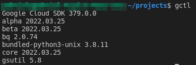

# **Google Cloud Platform - CHEAT SHEET**
[](https://github.com/jorgegabrielti/gcp-cheatsheet)

About
==========
This project aims to consolidate knowledge in Google Cloud Platform with a focus on cli tools. This is based in Docker.

[//]: # "[]()"

Table of contents
==========
<!--ts-->
   * [About](#about)
   * [Table of contents](#table-of-contents)
   * [Requirements](#requirements)
   * [To install requirements](#to-install-requirements)
   * [Install gcloud through Docker](#install-gcloud-through-docker)
<!--te-->

[//]: # "(## Feature)"
[//]: # "(- [x] [Packages utils](src/conf/packages.txt))"

Requirements
==========
- [x] **Git**
- [x] **Docker**
- [x] **Google Cloud Platform Account**
## **To install requirements**
---
Requirement             | How to install
-------------------------|----------------
**Git**                  | [**here**](https://git-scm.com/book/en/v2/Getting-Started-Installing-Git)
**Docker**               | [**here**](https://docs.docker.com/engine/install/)
**Google Cloud Account** | [**here**](https://cloud.google.com/apigee/docs/hybrid/v1.4/precog-gcpaccount)

### **Prepare the files structure**

Make the directory to gcloud configs:
```bash
mkdir -p ~/.config/gcloud
```
### **Run gcloud through Docker**
With the requirements met, let's run our container to start our configuration:

```bash
docker run -it --rm \
  --volume ~/.config/gcloud:/root/.config/gcloud \
  jorgegabriel/google-cloud:slim init
```

A tip to avoid the lengthy docker command is to create an alias in your **~/.bashrc**:
```bash
# Google Cloud
alias gctl="docker run -it --rm \
            --volume ${PWD}/.config/gcloud:/root/.config/gcloud \
            jorgegabriel/google-cloud:slim"
```

Then, just execute:
```bash
gctl 
```



